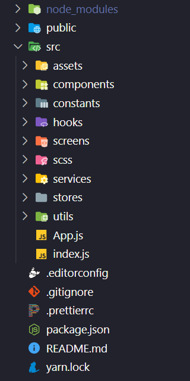
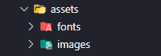
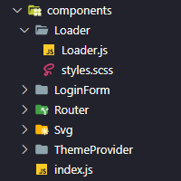
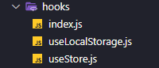
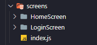
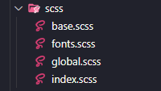
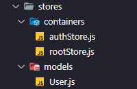
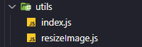

# React Web Boilerplate

Boilerplate para aplicações web em [React](https://reactjs.org) com [Mobx](https://mobx.js.org) na gerência de estados e [Material UI](https://material-ui.com) como biblioteca de componentes.

## Dependências

- [Mobx](https://mobx.js.org) - Gerenciamento de estado.

- [Mobx React](https://www.npmjs.com/package/mobx-react) - Aditivo ao Mobx que disponibiliza funções para interação com o ciclo de vida do React e auxilia na observação de mudanças no estado das stores por parte de componentes.

- [Mobx Easy](https://www.npmjs.com/package/mobx-easy) - Aditivo ao Mobx utilizado para facilitar o encapsulamento das stores possibilitando o acesso à uma store a partir de outra e organização de ambientes para chamadas http.

- [React Router](https://reactrouter.com/web) - Gerenciamento de rotas.

- [Axios](https://www.npmjs.com/package/axios) - Cliente HTTP baseado em promises utilizado para realizar requisições.

- [Prop Types](https://www.npmjs.com/package/prop-types) - Checagem de tipo para props.

- [Formik](https://formik.org) - Gerência de formulários.

- [Yup](https://www.npmjs.com/package/yup) - Criador de schemas para validação e parse de valores. Utilizado junto ao Formik.

- [Sass](https://www.npmjs.com/package/sass) - Pré-processador CSS.

- [Material UI](https://material-ui.com) - Biblioteca de componentes.

- [Fontsource Roboto](https://www.npmjs.com/package/@fontsource/roboto) - Fonte Roboto. Dependência do Material UI. **Este pacote pode ser ignorado no caso de uso de outra fonte no projeto.**

- [Material UI Icons](https://material-ui.com/pt/components/material-icons) - Biblioteca de ícones. Dependência do Material UI.

- [Material UI Pickers](https://material-ui-pickers.dev) - Date e time pickers.

- [Date IO / Date FNS](https://www.npmjs.com/package/@date-io/date-fns) - Tratamento de datas. Dependência do Material UI Pickers.

- [React Toastify](https://www.npmjs.com/package/react-toastify) - Biblioteca de Toasts customizáveis.

## Dependências de desenvolvimento

- [Eslint](https://eslint.org) - Linter.

- [Babel Eslint](https://www.npmjs.com/package/babel-eslint) - Interface entre o Babel e o Eslint.

- [Eslint Plugin React](https://www.npmjs.com/package/eslint-plugin-react) - Regras para lint de projetos React.

- [Eslint Config React App](https://www.npmjs.com/package/eslint-config-react-app) - Regras para lint de projetos React.

- [Eslint Plugin React Hooks](https://www.npmjs.com/package/eslint-plugin-react-hooks) - Regras para lint de React Hooks.

- [Prettier](https://prettier.io) - Formatador de código.

- [Eslint Plugin Prettier](https://www.npmjs.com/package/eslint-plugin-prettier) - Interface entre o Eslint e o Prettier.

- [Eslint Config Prettier](https://www.npmjs.com/package/eslint-config-prettier) - Desativa regras que poderiam causar conflito entre o Prettier o Eslint.

- [Pretty Quick](https://www.npmjs.com/package/pretty-quick) - Executa a formatação do Prettier ao salvar os arquivos modificados.

## Estrutura

### `src/assets`

Imagens, arquivos de fontes e outros assets.

### `src/components`

Todos os componentes do projeto. Criar um arquivo `index.js` para organizar múltiplos imports de components no mesmo arquivo.

### `src/constants`

Arquivos de constantes como o 'Theme.js' que guarda a configuração de cores e fontes do Material UI (além de outras), 'Messages' contendo as mensagens de feedback em validações de input e toasts e outros.

### `src/hooks`

Hooks customizados. Criar um arquivo `index.js` para organizar múltiplos imports de hooks no mesmo arquivo.

### `src/screens`

Todas as telas do projeto. Criar um arquivo `index.js` para organizar múltiplas importações de screens no mesmo arquivo.

### `src/scss`

Todos os arquivos de estilo globais do projeto. Criar um arquivo `index.scss` e importá-lo no arquivo `index.js` na raíz do projeto.

### `src/services`

Instâncias de clients HTTP para realização de chamadas assíncronas, módulos para conexão com serviços específicos e outros.

### `src/stores`

Containers que guardam as actions e gerenciam o estado da aplicação por seção e models de entidades.

### `src/utils`

Utilitários e funções helper diversas. Criar um arquivo `index.js` para organizar múltiplos imports de utils no mesmo arquivo.

